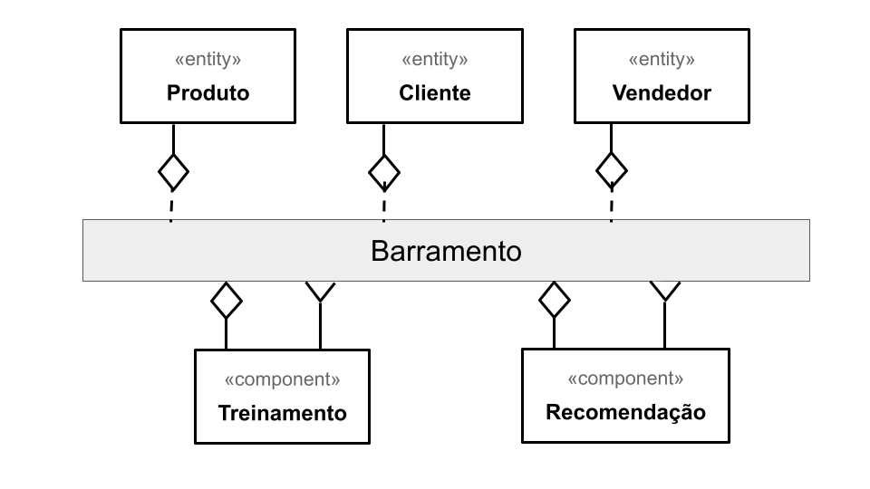

# Modelo para Apresentação do Lab01 - Estilos Arquiteturais

Estrutura de pastas:

~~~
├── README.md  <- arquivo apresentando a tarefa
│
└── images     <- arquivos de imagens usadas no documento
~~~

# Aluno
* `Daniel Salgado Costa`

## Tarefa 1 - Dados para Treinamento e Recomendação

### Treinamento
* Cliente
  * gênero
  * idade
  * localização
  * likes
* Vendedor
  * nicho
  * localização
  * número de vendas
  * likes
* Produto
  * preço
  * tamanho
  * cor
  * categoria
  * likes

### Recomendação
* Cliente
  * gênero
  * idade
  * localização
  * likes
* Vendedor
  * nicho
  * localização
  * número de vendas
  * likes
* Produto
  * preço
  * tamanho
  * cor
  * categoria
  * likes

## Tarefa 2 - Breve descrição de Composições Dinâmica e Estática

### Composição Dinâmica
> Os sistemas de treinamento e recomendação são dinâmicos pois recebem como dados as entidades que apesar de serem únicas, sejam elas Cliente, Vendedor ou Produto, para cada tipo de entidade podemos ter instâncias dessas entidades que se diferenciam uma da outra em relação as suas propriedades. Os sistemas de treinamento e recomendação portanto precisam lidar com essas diferenças.
### Composição Estática
> As entidades Cliente, Vendedor e Produto tem propriedades estáticas, ou seja, que não podem ser modificadas, com isso cada entidade é única e não é confundida com outra entidade.

## Tarefa 3 - Composição para Treinamento e Recomendação

